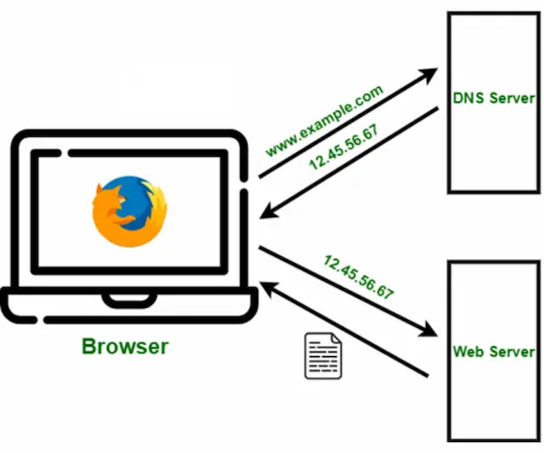
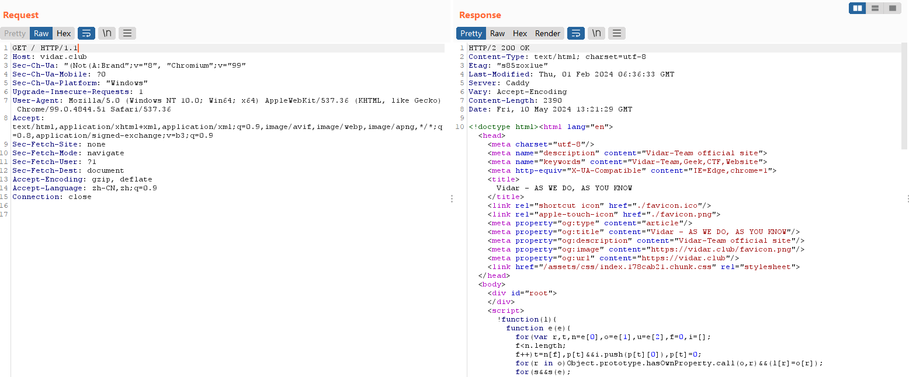

# HelloWeb

> 🚀本文档面向初次踏入 The Web World 的新生，希望为你们提供一个可供参考的学习路线。

> ✨该文档最早用于 Vidar-Team2024 届招新，转载请注明出处哦~

## 0x00 前言

Web 安全与 Web 开发往往是绑定在一起的，所以本文档会同时介绍 **安全&开发**，还会有一些零零散散的其他想要告诉新生的东西，所以内容会略多，希望多点耐心看完。

在开始之前，你们需要准备一些东西，要求不高，相信大家都有：

- 🧠能**独立思考**的大脑
- 💻可以使用的电脑
- 🔮流畅的网络
- ❤️**积极好学**的心

此外，所有想要涉足计算机领域的新生，都有必要去阅读一篇文章，其名为**《提问的智慧》**。篇幅不长，20min 即可，你可以从中学习到如何提出 **一个有价值的问题**，而不是掏出手机拍一张电脑屏幕，丢进群里就问“我该怎么办”，这是在浪费大家的时间。同时，你也可以把《提问的智慧》当作⼀个 AI prompt 指南。因为不论是对⼈还是对机器，提出一个有效的问题都能事半功倍地解决问题。

你可以点击下面的链接以阅读这篇文章。此外，Vidar-Team2024 招新群中也提供了 PDF 版本，需要请自取。

- [简体中文版《提问的智慧》](https://github.com/ryanhanwu/How-To-Ask-Questions-The-Smart-Way/blob/main/README-zh_CN.md)

> 🔍如果在此之前，你完全没有了解过计算机，但觉得能够成为一个整天抱着电脑“哐哐哐"敲键盘、张口闭口都是别人听不懂的怪话的程序猿是一件很酷的事情，那你依然可以阅读本文档，但其中很多名词你可能从未了解，你可以暂时跳到 ***0x05 泛用技能- 信息搜集*** 小节。

> 📷学会截屏。

## 0x01 Web

[Web](https://en.wikipedia.org/wiki/World_Wide_Web) 是 World Wide Web 的简称，是一个通过互联网访问的、由许多互相链接的的超文本组成的信息系统。这是指的广义上的 Web，即涵盖了整个世界范围内的互联网服务和资源的集合。这包括所有 **通过互联网连接** 的设备、服务、网络协议以及通过这些设备和服务访问的内容，它超越了单纯的网页和浏览器，涵盖了从大型服务器到个人设备的所有互联网技术。

我们日常所说的往往是狭义上的 Web，更加专注于构成网站和网络应用技术实践，包括传统的前后端开发、运维以及 Web 安全等领域。这与大家的生活就很贴近了，今日的学习、办公、娱乐都已经脱离不开网络应用技术，输入一串 URL 后浏览器如何得到一个功能完备的 Web 页面、在自己手机的“学习通”里上传一份 docx 附件后如何将其传递给教师，这都属于 Web 的范畴。现在的你可能并不明晰这些功能的实现原理，但经过一段时间的学习，相信你就可以对这些功能的实现有一个明确的认知，或者已经能够自己开发一个具备类似功能的 Web 应用。

除非有特殊说明，本文档后面的 Web 都是指狭义上的 Web 应用。

### 发展史

最初的 Web 应⽤非常简陋，程序托管在 ISP（Internet Service Provider，互联网服务提供商）那里，用户在自己的主机上访问对应 IP 获得对应的静态页面，页面中只有⽂字与图⽚，当时的用户能做的也只是浏览⽹⻚，没法与网页背后的机器（或人）进行更多的交流。这只是一个单方向的信息输出，人们并不满足于这一点。

为了丰富 Web 应用的功能，满足人们增长的需求，之后就有了 Flash 等媒体技术，大名鼎鼎的 JavaScript 编程语言也被研发出来。⾳视频和动态交互的实现给予了用户更高的自由度，越来越多的公司也开始通过互联网宣传自家产品，让潜在用户在家就能看到他们的产品信息。

随后，CGI（Common GatewayInterface）技术出现，Web 服务器可以通过 CGI 执⾏外部程序，外部程序可以根据请求内容⽣成动态内容返回给用户。现代 Web 应用的雏形已经出现。

再之后，随着 PHP/JSP 等编程语⾔的开发，MVC 思想、REST（Representation State Transformation）架构⻛格的提出，Web 应⽤的功能进一步增强，一片勃勃生机万物竞发之势。但随之而来的是安全问题频出，Web 安全也开始得到开发者的重视。

在之后就是越来越多的 Web 技术出现、应用逻辑越来越复杂，部分 Web 开发者难以忍受同时编写数据处理逻辑和网站页面，前后端分化。分化之后开发者们有了更多的精力钻研自己感兴趣的领域，技术不断发展，直到今天。

这里简单说说 **前后端的划分**。前端就是⽤⼾可以直接看⻅的部分，⽐如说我们访问 [baidu.com](https://www.baidu.com)，浏览器显示的搜索框、按钮等组件，以及我们输入 URL 之后字符串如何传递给后端应用，这些都属于 Web 前端的范畴；与之相对的，后端就主要是⽤⼾看不⻅的部分，⽐如在百度中搜索 [Vidar-Team](https://www.baidu.com/s?wd=Vidar-Team)，服务器在数据库中根据关键词查找相关内容，处理后整合成格式恰当的数据，再交给前端让浏览器去渲染出一个包含相关信息的页面，这就是 Web 后端负责的⼯作。

### Web 应用中的数据传递

> 这部分内容对 0 基础新生来说可能较为困难，可暂时跳过。

打开浏览器，地址栏中敲入 [https://vidar.club](https://vidar.club) 并回车，浏览器片刻就会返回给我们 Vidar-Team 的官网首页，这是如何实现的呢？下面我们会以此为例讲讲 Web 应用中的数据传递。

当浏览器接收到用户输入的 URL 时，首先会做的就是 [DNS 查询](https://www.ruanyifeng.com/blog/2022/08/dns-query.html)，浏览器会去查找这个 URL 背后对应的资源在什么地方，也就是这个域名对应的 IP 是什么。 

目前常见的 IP 地址格式一般为 [xxx.xxx.xxx.xxx]()，但人类要记住这样的 12 位纯数字比较困难。因此，开发者们决定⽤形象的域名（domain）来让⽤⼾记住资源的位置。你看，[vidar.club](https://vidar.club) 就⽐ [1.117.117.147](1.117.117.147) 这个 IP 好记太多了吧？浏览器根据域名向 DNS 服务器查询对应 IP 地址。DNS 服务器就像一本电话簿，里面详细记录了各种各样的域名与其对应的 IP 地址。在这个例子中，浏览器得到对应的 IP 地址就是 [1.117.117.147](1.117.117.147)。 

浏览器得知服务器的 IP 地址后，就会与其对应的服务器进⾏ TCP 三次握⼿。三次握⼿机制的目的时让通信的两端建立可靠的连接，毕竟谁也不想看到一个内容残缺的网页。为了让连接更加安全，本地主机与服务器在三次握手之后就会进⾏ TLS 协商。你看我们输⼊的是 `https://`，这表明我们使⽤了 HTTPS 协议访问主机资源。相⽐于明文传输数据的 HTTP，HTTPS 使⽤了 SSL/TLS 协议对数据进⾏了加密处理，这会让访问变得更加安全。当三次握⼿和 TLS 协商完成后，我们就已经和服务器建⽴了安全连接啦。

> 顺带一提，如果使用 `http://` 访问协会官网也会强制转化为 `https://` 哦，可以试试 [http://vidar.club](http://vidar.club)。

建⽴安全连接后，浏览器会向服务器发送 HTTP `GET` 请求，请求服务器返回我们事先放在服务器上的对应⽹⻚的内容，这个请求的内容通常是⼀个 HTML ⽂件。当服务器收到请求后，就会使⽤相关的响应头和 HTML 内容进⾏回复。

浏览器收到来自服务器的 `200 OK` 的 HTTP 响应，并收到服务端发过来的 HTML ⽂件后，会处理 HTML 标记并且构建 DOM 树，继⽽处理⻚⾯中引⽤的 CSS ⽂件，构建 CSSOM，将 DOM 树和 CSSOM 合并为渲染树，计算渲染树中每个元素的位置和⼤⼩，并确定它们在⻚⾯上的布局，最后在屏幕上进⾏绘制，最终就形成你看到的⻚⾯啦。

HTTP 请求和响应的具体内容可以使⽤浏览器（推荐使⽤ Chrome、Firefox 或 Edge）的 F12 开发者⼯具进⾏查看，或者使用上图中的 BurpSuite 或者 Yakit 等抓包工具。

如果对 Web 应用中的数据传递还有疑问，可先后观看以下两个视频，可以让你快速了解互联⽹和浏览器的运作流程：

- [10 分钟带你了解互联⽹是如何运作的](https://www.bilibili.com/video/BV1Rz4y197Jd/?spm_id_from=333.788.recommend_more_video.-1&vd_source=d77df35177e7fa05ef5f9e0b6ddf2180)
- [浏览器是如何运作的](https://www.bilibili.com/video/BV1x54y1B7RE/?spm_id_from=333.788.recommend_more_video.0&vd_source=d77df35177e7fa05ef5f9e0b6ddf2180)

## 0x02 Web安全

### 我是零基础小白，从哪里开始好呢？

在 Web 安全领域中，我们较少提及 `C/C++`，更多的是 `Java`、`PHP`、`Golang` 等语言相关的安全问题。不过，如果你⽬前没有任何编程基础，我们依然推荐你先好好学习 C 语⾔。对于没有编程基础的新生，从 C 语⾔这样⼀⻔接近底层的⾼级语⾔开始学习，可以更好地学习计算机内部原理。并且，在学习 C 语⾔后，你就有了⼀定的编程基础，⼊⻔其他语⾔也绝⾮难事。

C 语言的推荐教程是《C Primer Plus》，你可以跟着本书中的内容学习 C 语言。在学习的过程中，鼓励你跟着教程多上手跟着敲代码。计算机的学习与实践结合紧密，不是传统背书就行的。电子书地址提供在此，自行取用：

- [《C Primer Plus 第6版 中文版》PDF 文件](https://github.com/erhuoyan/bookrack/blob/master/C%20Primer%20Plus%20%E7%AC%AC6%E7%89%88%20%E4%B8%AD%E6%96%87%E7%89%88.pdf)
- [《C++ Primer Plus 第6版 中文版》原书代码和习题解答](https://github.com/ShujiaHuang/Cpp-Primer-Plus-6th?tab=readme-ov-file)

在上手敲代码之前，记得在你的系统中配置好 C 开发环境。

### 技术栈的选择

需要明确的是，安全和开发密不可分，在 Web 领域尤其如此。

开发是安全的基础，如果没有⼀定的开发能⼒，在之后的 Web 安全学习中，⾯对⼀些代码审计也会感到⾮常茫然。所以，在学习 Web 安全之前，有必要先掌握一定的 Web 开发技术。

> 🛠️如果你想要先行学习 Web 开发，可以跳到 ***0x03 Web开发*** 小节。

我们一般推荐，在入门 Web 安全的同时，要同步学习并掌握一门较为熟悉的 Web 后端开发语言，你可以在 Java/Golang/PHP/Node.js 中任选其一，当然其他的语言比如 Rust 也可以，遵循自己的喜好选择即可。

往前推个几年，研究 Web 安全最流行也必须掌握的语言是 PHP，那时的 CTF Web 赛题也是 PHP 赛题占主导。但在这两年风向有所变化，很多安全行业大牛（比如 [phith0n](https://www.leavesongs.com/)）认为，现在入门 Web 安全及漏洞挖掘最推荐学习的语言是 Java，毕竟现在多数 Web 应用都是之前的 Java 开发者留下的，包括现在的 CTF Web 中 Java 题目的占比也是越来越大。所以，如果你对前面提到的后端开发语言都不熟悉，不知道该选择哪个，也没什么很明确的规划，那就可以把 Java 作为首选项。

此外，在 Web 安全领域中，确实有前端安全的存在，比如 XSS 等，但前端安全很多时候是作为一个“锦上添花”的存在，不是很推荐作为主要研究方向。当然，一切看你兴趣。

### CTF竞赛

⼀直以来，Web 安全都是 CTF 竞赛重要的组成部分。

CTF 竞赛⽬前主体还是 [Jeopardy 解题模式](https://ctf-wiki.org/introduction/mode/)，分为 Web/Re/Pwn/Crypto/Misc 五个⽅向。相⽐⼆进制，Web 安全在初期⼊⻔时⻔槛较低，并不需要对底层知识有太多的了解，对⼩⽩较为友好，能够快速上⼿做题。

但不得不承认，Web 安全涉及内容更 **杂**。入门 Reverse 逆向工程，你只需要能读懂 C 即可，但入门 Web 需要你能在较短时间内快速接触并了解 Java/PHP/Golang 等编程语言。这需要你能坚持学习并投入一定量的时间。

倒也不用焦虑，刚上手有不懂的很正常。CTF 比较讲究一个实践先于理论，你很难办到先把理论一口气全部学完，然后再开始上手实践，这不怎么现实，因为东西又多又杂，你也摸不准一道题目会想考你什么。遇到不会的积极去查去学就可以，什么不会补什么，多做题多做笔记，遇到不会的题目就及时复现写 Writeup，刚开始的时候多坐牢（指做不出来题目盯着屏幕做无用功），后面就能少做牢。

在每个学年的上学期，Vidar-Team 会开放 HGAME-MINI 新生训练平台，里面的题目难度都比较适合初学者，可以多参与多做题，尝试把 Web 方向 AK 掉（All kill，指完成全部题目）。如果你想多做一些题目多学技术，可以使用下面的几个平台，这些平台都会提供往年的 CTF 赛题：

- [buuoj](https://buuoj.cn/)
- [攻防世界](https://adworld.xctf.org.cn/)

此外，有一个较为特殊的 Web 靶场，即由 BurpSuite 官方提供的 PortSwigger 靶场。该靶场收录了几乎所有 Web 常见漏洞，提供了原理讲解和由易到难、种类齐全的 100+ 练习题，并提供了官方题解和社区视频题解，在此过程中你还能熟悉 BurpSuite 的使用，非常推荐。

该靶场侧重让学习者了解并明白如何利用漏洞，并不是传统的 CTF 模式，所以没有找到 Flag 这一说，而是根据触发特定条件判断题目是否完成。靶场全英文。链接如下：

- [PortSwigger WebSecurity Academy](https://portswigger.net/web-security)

### 漏洞复现

打 CTF 竞赛是社团活动的主要内容，但并不是全部，归根究底打比赛的目的也是学技术。在打比赛之外的时间，复现最新的漏洞或者一些老但知名的漏洞也是很好的学习方式。

CVE（Common Vulnerabilities and Exposures，通用漏洞和暴露）是公开披露的网络安全漏洞列表。它是由 MITRE 公司维护和更新的安全漏洞列表，并由美国国土安全部（DHS）和网络安全与基础设施安全局（CISA）赞助。在CVE中，每个漏洞都会有一个唯一的CVE编号，即CVE ID，例如“CVE-2019-1234567”。这个编号是识别漏洞的唯一标识符，供安全研究员和受攻击的软件供应商使用，以便确定和回应安全漏洞。CVE编号由CVE编号机构（CVE Numbering Authority，CNA）分配，CVE编号机构主要由IT供应商、安全厂商和安全研究组织承担。

我们一般所谓的复现漏洞，多数时候是指复现这些 CVE 漏洞，为了更好的理解这些漏洞的原理，我们会需要在本地搭建环境并进行模拟攻击。有时候自己搭环境会比较麻烦，网上找到的博客教程偶尔不靠谱。

推荐一个 phith0n 的漏洞复现 GitHub 仓库，里面收录了很多有价值的漏洞，并且提供了构建环境所需的 Dockerfile 和 docker-compose.yml 文件，以及复现方式，非常方便：

- [Vulhub 官网](https://vulhub.org/#/environments/) | [Vulhub 仓库](https://github.com/vulhub/vulhub)

### 渗透

> 📞遵纪守法，**任何渗透活动都应遵循相关的法律和道德准则**。勿碰黑灰产。

Web 渗透，也被称为 Web 渗透测试或 Web 渗透攻击，是一种评估网络应用安全性的方法。它涉及到模拟恶意攻击者的行为，以发现、利用和理解网络应用中的安全漏洞。

这块和 Red Team 关系更近，有兴趣的可以自行了解。一次完整的渗透包括很多环节：选定目标后，首先要做信息搜集，使用一些工具或搜索引擎搜集目标相关资产，包括子域名什么的，然后进行外围打点，看看能不能找到一些突破口，拿下外围设备后就可以尝试上传木马控制主机权限，做权限维持，如果可以的话再进行提权，然后扫描内网网段，看能不能进行横向或者纵向移动，尝试拿下更多内网主机……

如果你对渗透相关的安全内容感兴趣，可以通过以下两个靶场进行学习：

- 国内：[春秋云镜 - 仿真场景](https://yunjing.ichunqiu.com/)
- 国外：[Hack The Box](https://app.hackthebox.com/)

更推荐后者，Hack The Box 提供了更加系统的 Red/Blue Team 的学习教程（全英文），以及对应的靶机实操练习。相信你可以从中找到乐趣。

### 工具

Web 安全领域的工具实在是有“一点点”多，CTF、漏洞挖掘、渗透各自有各自的工具，相同功能的工具还有很多变种、不同团队的实现，该文档没法一一列举。此处就只列出最常用的安全工具，二选一即可：

- [BurpSuite - 成熟的⽹络安全⼯具](https://portswigger.net/burp)

- [Yakit - 集成化单兵安全能⼒平台](https://yaklang.io/products/intro/) 

如果你对这两个⼯具尚不了解，可以在⽹上搜索⼀些相关使⽤教程，起步阶段对这些⼯具的要求不⾼，简单的抓包改包即可。BurpSuite 的学习可以结合前面提到的 PortSwigger 靶场。

## 0x03 Web开发

欢迎来到有趣的 Web 开发领域，前面已经介绍过 Web 领域中前后端的划分，从开发的角度来说，一般推荐挑选其中一个方向进行学习。一方面是因为前后端开发技术经过了很多年的发展，各自都有着深厚的技术积累，即使你不准备去了解那些已经过时的旧技术，近几年的新技术也足够你学习很长一段时间了；另一方面是因为人的精力终究是有限的，想在短时间内同时推进前后端的学习并想要有所建树，是一件相对困难的事情。当然跟随自己的兴趣来就好，刚开始都接触一下也不是什么坏事，说不准你就是下一个全栈大师。

但说实话，这东西也没什么固定的路数，协会 Web 成员在学习开发时的路线和技术栈也各不相同，没法提供一个同统一的路线。下文中的前后端开发入门都仅为编写文档的人的个人看法，请自行斟酌。

Web 前后端开发的学习过程差异较大，技术栈也少有重合，这里就分开介绍。

> 🥳 HDU 有一个名为 [HDUHelp 杭电助手](https://www.hduhelp.cn/) 的社团。你会发现，杭电的很多网络服务都是由杭电助手开发并维护的，该社团也会在新学期开始时展开招新活动，老东西会为技术部新人提供相对统一的学习路线指导，欢迎加入杭电助手技术部~

> 🔔 杭电助手后端部技术栈为 Golang；HDU 未央学社后端部技术栈为 Java。

> 🥰 Vidar-Team 与 HDUHelp 关系颇深，协会 Web 方向成员与 HDUHelp 技术部成员重合度很高。

### 前端开发

前端开发对新手比较友好，因为你能直观地看到代码在浏览器中被渲染为页面，正反馈比较强，也不会说你学几天后做出来的东西没法给别人展示。

这里简单介绍下 Web 前端开发入门需要学哪些东西，之后的内容可以自行探索。

#### 原生三件套

前端开发的基础就是 `HTML` + `CSS` + `JavaScript`，后面应用框架的学习也要基于这三者。把网站的前端比作人体的话，HTML 就是骨骼，负责支撑起网站的整体架构；CSS 是皮肤，负责给予网站优雅的外观；JavaScript 则是肌肉，让网站具备动态交互的能力。推荐教程是 [MDN Web](https://developer.mozilla.org/zh-CN/)，该站点是极其优质的 Web 前端开发知识库，认可度很高，很多流行前端框架的官方教程也把它作为 Web 前端领域中的 Wiki 来引用。

当然，MDN 对初学者的问题是，其内容过于正式，单个小节的内容过多以至于消磨掉初学者耐心。如果你想在短时间内快速过一遍 Web 前端的简要内容，可以看这个：[菜鸟教程](https://www.runoob.com/)，精简很多，但内容不全且稍有过时。

在学习的过程中，你会发现前端的东西比较杂乱，原生 HTML 中就有几百个标签，不同类的标签往往又会有十几个不同的属性，不同属性还有不同的可选值，CSS 中的各种选择器、伪类伪元素以及几百个属性也足以让你头大。不过这些你不用去记，真正到应用开发过程中，你就会发现能用到的其实不多，第一次看的时候稍微留意一下，脑子里有个概念、知道大概有这么个东西就行，敲代码的时候忘了就去翻文档，毕竟开发时又不是断网环境，只要你能把应用功能实现，怎么搞都行。

`JavaScript` 相对前两者重要一些，因为网页的主要功能都要使用 `JavaScript`（下文简称 JS）实现，之后接触的前端应用框架也主要是 JS 框架，包括后面如果你想以一个前端开发者的身份快速上手后端开发，基于 JS 语法的一系列 Node.js 后端框架也是你的首选。因此，你有必要多投入一些精力到 JS 的学习上。

这里推荐一份 JavaScript 的练习教程，跟着敲敲也蛮有帮助的，可以作为参考：[JavaScript 30](https://javascript30.com/)。

#### JavaScript框架

到了应用框架这层，你会发现——可选项更多了。开发者们整天轮子叠轮子的造，同一种功能的实现能给你整出来几十个大大小小的框架，开发者们也整天在社交媒体上因为技术选型而唇枪舌战。吵到今天，应用框架也大致分为了两派，分别是 Vue 和 React。

你可以在这两者中挑一个上手，这里不做推荐，自己去官网看看，考虑自己喜欢哪种风格之后再上手，反正之后两个都得会（乐）。学的时候跟着官方教程走就好，下面是二者的官方文档：

- [React](https://react.dev/) | [React 官方中文文档](https://zh-hans.react.dev/)
- [Vue.js - 渐进式的 JavaScript 框架](https://vuejs.org/)
- [Angular](https://angular.cn/)

此外，当你上手前端应用框架时，就可以抛弃 JavaScript 而转向使用 TypeScript 了。

TypeScript（简称 TS）是微软公司开发的一种基于 JS 的编程语言，其目的是增强 JS 的功能，使其更适合多人合作的项目。TypeScript 可以看成是 JS 的超集（superset），即它继承了后者的全部语法。所有 JavaScript 脚本都可以当作 TypeScript 脚本（但是可能会报错），此外它再增加了一些自己的语法。

TS 对 JS 添加的最主要部分，就是一个独立的类型系统。JS 本身是有一套自己的类型系统，但其非常弱，运算符可以接受各种类型的值。这使得 JS 语法变得非常灵活，但客观上也增加了多人协同项目中出错的概率。在语法上，JS 属于动态类型语言。TS 引入了一个更强大、更严格的类型系统，属于静态类型语言。静态类型有利于代码的静态分析，更早地发现错误，提供了更好的 IDE 支持，做到语法提示和自动补全，提供了代码文档，有助于代码重构。

平心而论，很多项目其实没必要使用 TypeScript，严格的类型限制和语法要求会降低开发效率。但你架不住多人合作的时候别的前端开发都要用，以及有时候参加项目竞标或者比赛，其他组都用 TS，你一个人用 JS 把项目搞定了，很多不懂技术的评委也只会认为你不会，而不是你不屑于去用。关于到底使用 JS 还是 TS 也是一个长期争论的问题，自行决定。

> 🧐这块的描述确实不太准确，其他 JS 框架比如 Angular 的使用者也不在少数，上文中提到的 React 严格来说只能算视图层面的库，其背后的 Next.js 才是官方主推的应用框架。不过这些对初学者来说不重要，先大致有个了解，学到后面接触到这些的时候再去调整自己的技术栈。

### 后端开发

与前端相比，后端就主要是在于机器交流，你要操纵用户看不到的数据。后端没法做到像前端那样敲个代码立马就能看到反馈，不过胜在学习路线清晰，整体开发流程更加统一。

后端开发技术选型和语言关系比较大，此处以 Golang 为例进行介绍。

#### 上手

Golang，也称为 Go 语言，是由 Google 开发的一种静态强类型、编译型语言。Go 语言的语法与 C 在许多方面相似，但它包含了垃圾回收的功能，且支持并发编程，同时更加简洁。这些优势使得 Go 在网络开发以及云原生方面有一些独特的优势。如果你学过 C 的话，Go 其实挺好上手的。

有以下两个推荐教程，不推荐看菜鸟教程，太浅了：

- 在线学习 Golang 的网站，手把手教你一步步敲代码：[Go 语言之旅](https://tour.go-zh.org/welcome/1)
- 看书的话就选这本，[Golang 圣经](https://golang-china.github.io/gopl-zh/)

在踏入下一步之前，你还有必要先了解 SQL。SQL，全称为 **结构化查询语言**（Structured Query Language），是一种用于管理关系数据库的标准编程语言。它包括一系列用于创建、修改、删除和查询数据库的命令。Web 后端应用基本都会有存储数据的需求，你不能把数十万条需要持久存储的数据一直保存在本地内存中，而是需要用类似 MySQL 这样的数据库帮存储你的数据。

- [W3school SQL教程](https://www.w3school.com.cn/sql/index.asp)

#### 框架

当你熟悉 Golang 语法之后，就可以上手 Web 应用框架了。推荐给初学者的 Golang 后端三件套是 `Gin` + `Gorm` + `MySQL`，去看各自的官方教程即可。

Gin 是一个 Web 应用框架，这个都懂。开发者固然可以使用 Golang 自带的 `net/http` 处理客户端请求、处理并返回数据，但每次都这么做未免有些累赘；而且有时我们需要为某些 API 添加统一的鉴权，或者为所有处理请求事件添加日志记录，如果我们使用原生库去一个接口一个接口地去完成这些工作，那可就太费事费力了。

所以，经过积累，开发者们就将某些常用的功能，比如动态路由实现、分组控制、中间件、模板渲染与错误恢复等，将它们抽象出来并进行封装，打包成一个开箱即用的 Web 应用框架。当其他开发者想要实现某些功能时，直接导包引用该框架即可，这大幅提升了 Web 应用的开发效率，也在规范化和标准化等方面做出贡献。

- [Gin](https://gin-gonic.com/)

Gorm 是一个基于 Golang 开发的全功能 ORM 框架。那什么是 ORM 呢？你在学习 Golang 语法时或许已经知道该如何拼接 SQL 语句并进行数据库操作了，但这么搞的问题是效率低下，而且有些粗心的开发者疏于对用户传入数据的处理，可能会导致一些安全问题，比如 SQL 注入漏洞。

为了解决上述问题，ORM 应运而生。ORM 全称 **对象关系映射**（Object-Relational Mapping），是一种程序设计技术，用于实现面向对象编程语言里的对象和关系数据库之间的映射。有了 ORM，开发者可以直接使用面向对象的方式来操作数据库，无需编写 SQL 代码，大大提高了开发效率，框架自带的预处理等防范措施也提高了 Web 应用的安全性。当然，代价就是牺牲了一定的灵活性。

- [GORM 指南](https://gorm.io/zh_CN/docs/index.html)

## 0x04 Network

因为本文档讨论的主要是狭义上的 Web，Network 其实一般不会在此处提及。但因为 Network 在 Web 渗透领域的使用，以及 Vidar-Team 最近两届的网管都是 Web 手，所以本文档也单独划出 Network 的小节。

写这篇文档的人 Network 技术相对一般，这里就少啰嗦一些废话。如果你对计算机网络感兴趣但没有基础，可以自行学习 [HDU-CS-WIKI 计算机网络](https://hdu-cs.wiki/9.%E8%AE%A1%E7%AE%97%E6%9C%BA%E7%BD%91%E7%BB%9C/9.%E8%AE%A1%E7%AE%97%E6%9C%BA%E7%BD%91%E7%BB%9C) 章节的内容，可以快速的给你通一遍网络相关概念，方便你进一步的学习。

如果你对自己的网络水平有自信，并且有意向加入 Vidar-Team 成为下一届网管，就在招新群里吆喝一声，很快就可以吸引到 Vidar 历届网管的注意，线下交流讨论。

此外，HDU 有一个由学生自发创建的去中心化网络，名为[“DN11”](https://dn11.top/)，欢迎有一定网络基础的学生加入。

## 0x05 泛用技能

有些东西并不怎么成体系，但也是新生有必要知道的，同时又不怎么好分类，索性一块丢到这个小节下面。

### 信息搜集

### Git 版本管理工具

### Linux 操作系统

### Docker 

## 0x06 可选事项

### 个人博客

### 兔兔的小游戏

### 或许，可以更快一些？

## 0x07 更多资料

## 0x08 后话